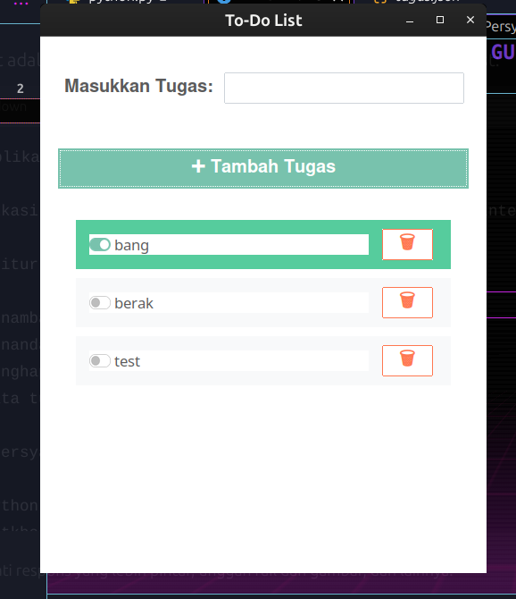

# Aplikasi To-Do List dengan GUI

Aplikasi To-Do List ini dibangun menggunakan Python `tkinter` dan tema `ttkbootstrap`. Pengguna dapat menambah, menandai selesai, dan menghapus tugas, dengan data yang disimpan dalam file `tugas.json` untuk memastikan data tetap ada saat aplikasi dibuka kembali.

## Fitur

- Menambah tugas baru
- Menandai tugas sebagai selesai
- Menghapus tugas
- Data tugas disimpan secara otomatis

## Persyaratan

- Python 3.x
- `ttkbootstrap` (untuk UI)

Instal `ttkbootstrap` dengan:

```bash
pip install ttkbootstrap


## Prepiew


